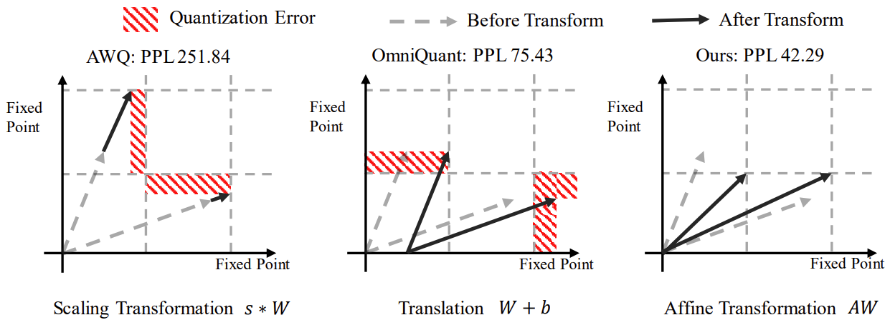
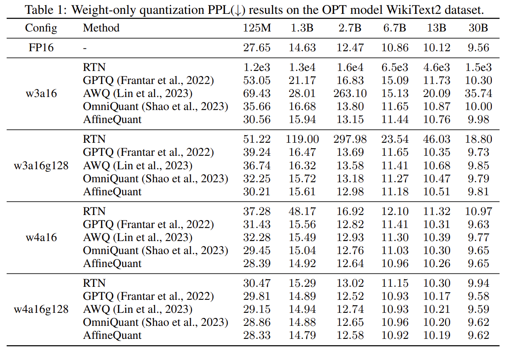
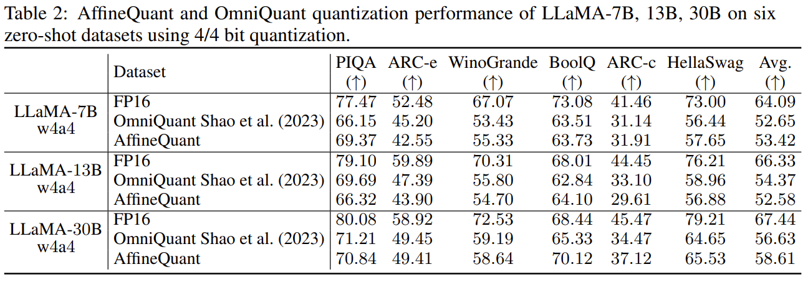
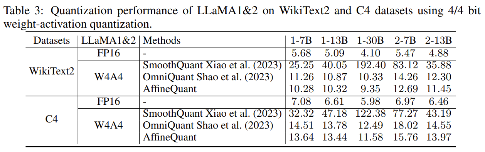

# AffineQuant: Affine Transformation Quantization for Large Language Models ([Link](https://arxiv.org/pdf/2403.12544.pdf))


AffineQuant is a simple and powerful quantization technique for LLMs. 



## Contents
- [AffineQuant: Affine Transformation Quantization for Large Language Models](#affinequant-affine-transformation-quantization-for-large-language-models)
  - [Contents](#contents)
  - [Install](#install)
  - [Model Zoo](#model-zoo)
  - [Usage](#usage)
  - [Results](#results)
  - [Related Project](#related-project)
  - [Citation](#citation)

## Install
```
conda create -n affinequant python=3.10 -y
conda activate affinequant
git clone https://github.com/bytedance/AffineQuant.git
cd AffineQuant
pip install --upgrade pip 
pip install -e .
```

We also leverage the kernel from [AutoGPTQ](https://github.com/PanQiWei/AutoGPTQ) to achieve real quantization. So you should also install the bug-fixed AutoGPTQ as follows:
```
pip install auto_gptq
```

## Model Zoo

Coming Soon.

## Usage
**We provide full script to run AffineQuant in `./scripts/`**. We use LLaMa-7B as an example here:
1. Obtain the channel-wise scales and shifts required for initialization:


Optional, we also offer the script that you can generate channel-wise scales and shifts by yourself:
```
python generate_act_scale_shift.py --model /PATH/TO/LLaMA/llama-7b
```

2. Weight-only quantization
```
# W3A16
CUDA_VISIBLE_DEVICES=0 python main.py \
--model /PATH/TO/LLaMA/llama-7b  \
--epochs 20 --output_dir ./log/llama-7b-w3a16 \
--eval_ppl --wbits 3 --abits 16 --lwc --let --use_ln_matrix --sf 1e-2

# W3A16g128
CUDA_VISIBLE_DEVICES=0 python main.py \
--model /PATH/TO/LLaMA/llama-7b  \
--epochs 20 --output_dir ./log/llama-7b-w3a16g128 \
--eval_ppl --wbits 3 --abits 16 --group_size 128 --lwc --let --use_ln_matrix --sf 1e-2
```

3. weight-activation quantization
```
# W4A4
CUDA_VISIBLE_DEVICES=0 python main.py \
--model /PATH/TO/LLaMA/llama-7b  \
--epochs 20 --output_dir ./log/llama-7b-w4a4 \
--eval_ppl --wbits 4 --abits 4 --lwc --let --aug_loss --use_matrix --sf 0.1 \
--tasks hendrycksTest,piqa,arc_easy,arc_challenge,boolq,hellaswag,winogrande
```

More detailed and optional arguments:
- `--model`: the local model path or huggingface format.
- `--wbits`: weight quantization bits.
- `--abits`: activation quantization bits.
- `--group_size`: group size of weight quantization. If no set, use per-channel quantization for weight as default.
- `--epochs`: training epochs. You can set it as 0 to evaluate pre-trained AffineQuant checkpoints.
- `--nsamples`: number of calibration samples, 128 as default.
- `--eval_ppl`: evaluating the perplexity of quantized models.
- `--tasks`: evaluating zero-shot tasks.
- `--resume`: loading pre-trained AffineQuant parameters.
- `--multigpu`: to inference larger network on multiple GPUs
- `--real_quant`: real quantization, which can see memory reduce
- `--save_dir`: saving the quantization model for further exploration.
- `--use_matrix`: using qkt affine mateix or not.
- `--use_ln_matrix`: using layernorm affine matrix.
- `--sf`: stability factor for gradual mask.


## Results
- AffineQuant achieve SoTA performance in weight-only quantization

- AffineQuant achieve SoTA performance in weight-activation quantization




## Related Project
[SmoothQuant: Accurate and Efficient Post-Training Quantization for Large Language Models](https://github.com/mit-han-lab/smoothquant)

[AWQ: Activation-aware Weight Quantization for LLM Compression and Acceleration](https://github.com/mit-han-lab/llm-awq)

[GPTQ: Accurate Post-training Compression for Generative Pretrained Transformers](https://github.com/IST-DASLab/gptq)

[RPTQ: Reorder-Based Post-Training Quantization for Large Language Models](https://github.com/hahnyuan/RPTQ4LLM)

[OmniQuant: Omnidirectionally Calibrated Quantization for Large Language Models](https://github.com/OpenGVLab/OmniQuant)

[MLC LLM](https://github.com/mlc-ai/mlc-llm)

[AutoGPTQ](https://github.com/PanQiWei/AutoGPTQ)

## Citation

```latex
@inproceedings{
ma2024affinequant,
title={AffineQuant: Affine Transformation Quantization for Large Language Models},
author={Yuexiao Ma and Huixia Li and Xiawu Zheng and Feng Ling and Xuefeng Xiao and Rui Wang and Shilei Wen and Fei Chao and Rongrong Ji},
booktitle={The Twelfth International Conference on Learning Representations},
year={2024},
url={https://openreview.net/forum?id=of2rhALq8l}
}
```
